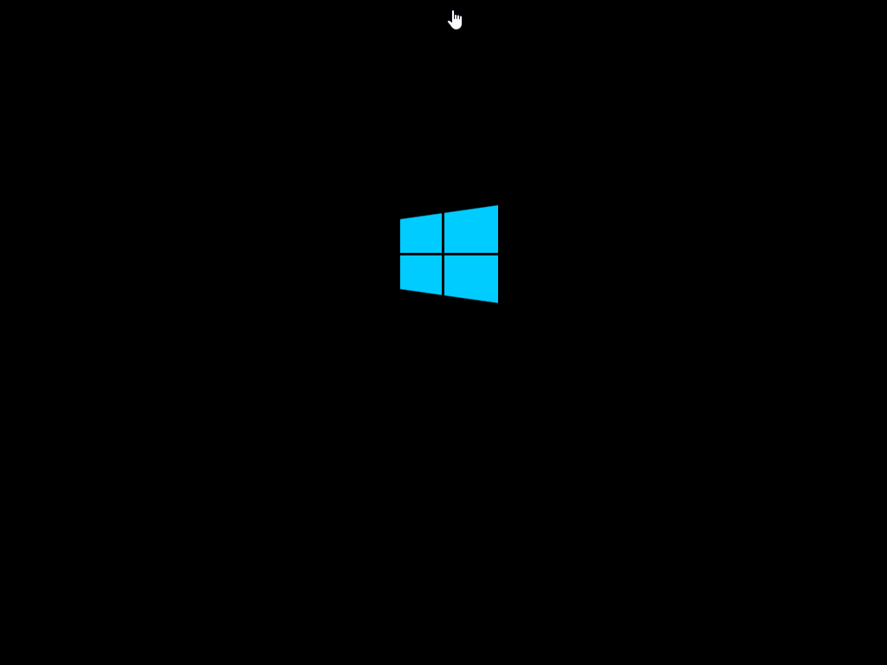

# Basic-Windows-Imaging
A very simple and effective way to image Windows based machines using WIM files.

These are a few basic scripts that I've been using for a few years now to image Windows PCs. This is a good alternative for those using Clonezilla, FOG, or the like to deploy Windows based images. It's much faster and simpler than those alternatives. 

## Getting Started
### The image host and folder
**imagestart.bat** will mount a network folder as the N:\ drive in order to see the **base.bat** file and your WIM files. Make sure the account you'll be using to install these images has access to the network share. 

For instance, I have my image and **base.bat** file located in:

`\\vm-storage01\tools\imaging`

### Creating the WinPE Image
The **startnet.cmd** and **imagestart.bat** are added to a WinPE boot.wim file under System32. You can use the following guide to create a WinPE image:
https://charbelnemnom.com/how-to-create-a-custom-winpe-boot-image-with-powershell-support-powershell-deploy-windowsserver/
**NOTE:** Make sure to install PowerShell using the guide, as the **imagestart.bat** uses PowerShell for secure text storage

Using the instructions from the link above you will stop at **Creating a WinPE ISO Image**, from there you will edit **imagestart.bat** and set the following variables:

Save the file and copy both the **imagestart.bat** and **startnet.cmd** to the System32 folder of your mounted WinPE image.

Follow the rest of the instructions provided in the link above. Make sure to add the network, storage, and chipset drivers needed for the majority of the devices you will be imaging.

### Creating a base image
This tool and guide isn't meant to show you how to create WIMs but a simple and easy way that I create them is download whichever version of Windows from Microsoft that you'd like using the [Windows Media Creation](https://www.microsoft.com/en-us/software-download/windows10) tool, extract the iso to a folder, then use a tool like [NTLite](https://www.ntlite.com/) to strip uneeded Microsoft bloat, install updates, install drivers, etc. The tool currently selects #1 indexed image within the WIM but the script could be easily modified to use a value as a variable to pick which image within the image to write onto the disk.

## Getting the tools ready
After your WIM(s), WinPE, and network folders have all been created, place the WIM and **base.bat** in your network share. 
Your WinPE image can either be ran from a flash drive, PXE boot, disc, etc. Using PXE makes the imaging process a little faster and simple since you do not need to keep any physical media with you.

## Imaging a PC
Now all you need to do is boot your WinPE image, login with your network credentials, and using the following command to install your image.
`base.bat mywindowsimage.wim`
